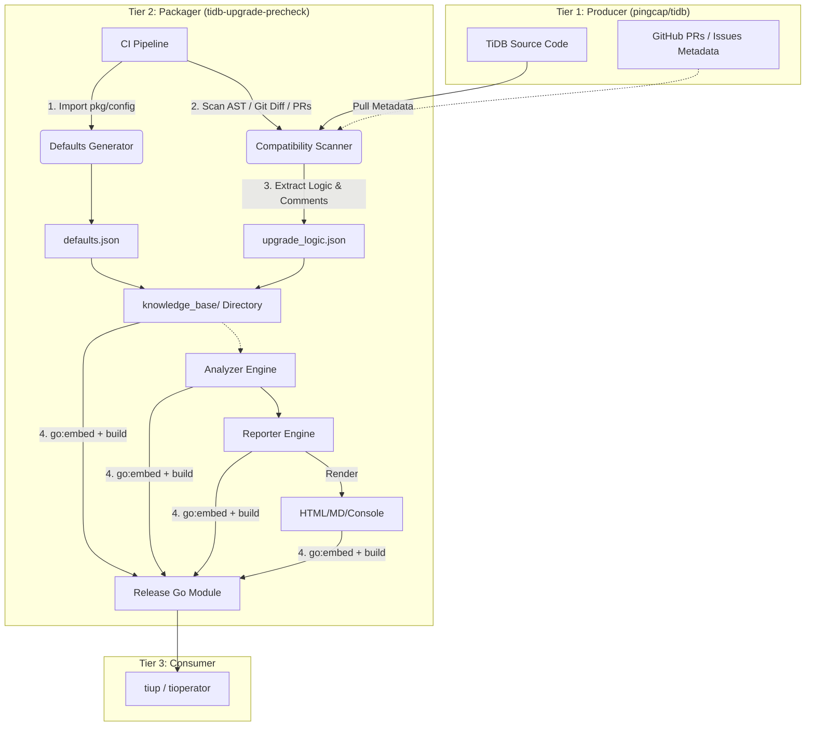

# TiDB Upgrade Precheck System Design

## 🎯 Project Goals and Core Value

### Project Name
tidb-upgrade-precheck

### Core Problem
Hidden risks in TiDB cluster upgrades caused by changes in "configuration parameters" or "system variables" in the target version (such as default value changes, deprecation, forced overrides).

### Core Value
1. **Risk Prevention**: Automatically identify P0/P1/P2 level risks before upgrade.
2. **Decision Support**: Provide unified "planning", "confirmation" and "skip" modes.
3. **Zero Intrusion**: No need to modify TiDB code; rely on external scanners to extract knowledge.
4. **Knowledge Transfer**: Automatically transfer domain knowledge from R&D side (through comments) to Operators.
5. **Audit and Archiving**: [New] Generate formal reports in Markdown/HTML format containing risk summaries and full configuration audits.

---

## 1. 🏛️ Core Architecture (Three-tier Architecture Based on Scanner)

We adopt a three-tier architecture: Producer -> Packager -> Consumer.


Note: There are no active implementation requirements for the Producer component at this stage, as the generation of the Knowledge Base is currently driven by the kb-generator utility on the Packager side. The Producer abstraction is preserved within the architectural design to support potential future scalability and feature expansion.
---

## Part I: R&D Side Implementation (Production and Packaging)

### 2. 🧬 Knowledge Base Generation Strategy

The tidb-upgrade-precheck repository contains a core CLI tool: kb-generator.

### 3.1. Task 1: Generate defaults.json (P1/P2 Risks)

- **Strategy**: Runtime Import.
- **Mechanism**: Directly import the target version package and serialize default values.
- **Metadata**: Extract internal version number CurrentBootstrapVersion (e.g.: 218).

### 3.2. Task 2: Generate upgrade_logic.json (P0 Risks)

- **Strategy**: External intelligent scanning (zero intrusion).
- **Mechanism**:
  - AST Analysis: Parse pkg/domain/upgrade.go to find SET GLOBAL call patterns.
  - GitHub Mining: Automatically extract comments from PR descriptions.

### 3.3. Command Examples

```bash
# Incremental (Release)
kb-generator scan --repo=... --from-tag=v7.5.0 --to-tag=v8.1.0

# Full rebuild (Bootstrap)
kb-generator scan --repo=... --all
```

Full collection starts from version 6.5.0 to get all variable and configuration parameter default values as the baseline for each version, and then collect the content of variables that are forcibly changed during upgrades.

### 3.4. Task 3: Generate upgrade knowledge base for TiKV, PD, TiFlash modules (P0 Risks)
ToDo
---

## Part II: Runtime and Integration (User Side)

To minimize code development workload and code maintenance difficulty, we recommend that all core code be in the tidb-upgrade-precheck repository:

1. All collector capabilities:
   1. Truly implement collection of corresponding data from source clusters to be upgraded by users
   2. Implement collection of configuration parameters and variables for core modules such as TiKV, PD, TiFlash

2. Main implementation of analyzer:
   1. Analysis rules, risk rule application, risk identification
   2. Implementation of analyzers for core modules such as TiKV, PD, TiFlash

3. Unified report output mode

4. Other tools such as tiup and tioperator only need to call the corresponding functions:
   1. Support corresponding command line parameter entry knowledge to integrate the corresponding precheck command, maintain cluster topology, access database information in commands and output format for the main program to call
   2. Tools only keep the minimum code related to tool commands

> **Important Note**: tidb-upgrade-precheck does not directly generate a precheck command. This command needs to be extended by tiup and tioperator themselves, and then executed by calling our API library in a similar way.

---

## 3. ⚙️ Runtime Workflow

### 4.1. Collector

- Fetch real-time configuration of current cluster (GLOBAL_VARIABLES, /config).
- Detailed design of upgrade knowledge base collection tool

### 4.2. Analyzer - Core Logic and Audit

Compare Current_State (current), Source_KB (source) and Target_KB (target).

**Logic Step 1: Source Determination**
- If current value == source default → UseDefault
- If current value != source default → UserSet

**Logic Step 2: Risk and Audit Matrix**

| Source State | Target State | Risk Level | Action |
|--------------|--------------|------------|--------|
| UseDefault | Default Changed | MEDIUM | Recommendation |
| UseDefault | Forced Upgrade | HIGH | Must Handle |
| UserSet | Default Changed | INFO | Configuration Audit |
| UserSet | Forced Upgrade | HIGH | Must Handle |
### 4.3. Reporter [New]

Support rendering the following formats:
- Console: Brief summary + high/medium/low details.
- Markdown (.md): Contains risk summary table + full configuration audit table.
- HTML (.html): Web report with styling.

---

## 4. 🤝 Integration Blueprint

### 5.1. tiup Integration

- New parameters: `--report-format=md,html` and `--report-dir=/tmp`.
- Logic:
  - Mode 1 (Execute): Check -> Terminal Report -> Interactive Confirmation (y/N) -> Upgrade.
  - Mode 2 (Planning): Check -> Terminal Report -> Generate MD/HTML File -> Exit.
  - Mode 3 (Skip): Skip Check -> Upgrade.

### 5.2. tioperator Integration

- Logic:
  - Mode 1 (Execute): Pause Upgrade -> Write Report to Status/Events -> Wait for Annotation.
  - Mode 2 (Planning): Write Report to Status -> Do Not Upgrade.

---

## 5. 🖥️ Appendix: Output Examples (DEMO)

### 6.1. Markdown Report (report.md)

```markdown
# TiDB Upgrade Precheck Report
**Cluster:** prod-cluster
**Upgrade Path:** v7.5.1 (Bootstrap: 180) -> v8.5.3 (Bootstrap: 218)

## 1. Executive Summary

| Risk Level | Count | Description |
| :--- | :---: | :--- |
| 🟥 **HIGH** | 1 | **Must handle.** Upgrade may fail or behavior changes dramatically. |
| 🟨 **MEDIUM** | 1 | **Recommended optimization.** Performance may lag or new features not obtained. |
| 🟦 **INFO** | 5 | **Configuration audit.** User-customized configuration items (safe differences). |

---

## 2. Critical Risks

### [HIGH] Forced Upgrade Logic
* **Component:** TiDB
* **Parameter:** `tidb_enable_new_storage`
* **Impact:** v8.5.3 upgrade program will **force override** your setting ('OFF') to 'ON'.
* **R&D Note:** *v8.0+ mandatory requirement. This may increase disk usage by about 10%.*

---

## 3. Recommendations

### [MEDIUM] Feature Lag
* **Component:** TiDB
* **Parameter:** `tidb_executor_concurrency`
* **Current:** 5 (old default) -> **Target Default:** 10
* **Recommendation:** Your cluster will retain the old default value '5'. We recommend manually adjusting to '10' for better performance.

---

## 4. Configuration Audit

> **Note:** The following parameters have been explicitly modified by you (UserSet), and are different from the default values of the target version. Please review.

| Component | Parameter | Your Value | Target Default | Status |
| :--- | :--- | :--- | :--- | :--- |
| TiKV | `raftstore.apply-pool-size` | `3` | `2` | ✅ User Customized |
| PD | `schedule.replica-schedule-limit` | `16` | `64` | ✅ User Customized |
```

### 6.2. HTML Report Effect (report.html)

HTML version content is consistent with Markdown, but adds:
- Color coding: High (red background with white text), Medium (yellow background), Info (blue background).
- Collapse/expand: If the "configuration audit" list is long, collapse by default and click to expand.
- Print friendly: Adapt CSS print styles.

---

## 6. 📚 API Library Usage for Integration

For integration with tiup and tioperator, the recommended approach is to use tidb-upgrade-precheck as a library:

```go
import "github.com/pingcap/tidb-upgrade-precheck/pkg/collector"
import "github.com/pingcap/tidb-upgrade-precheck/pkg/analyzer"
import "github.com/pingcap/tidb-upgrade-precheck/pkg/reporter"

// Example integration
func runUpgradePrecheck() error {
    // 1. Collect current cluster state
    snapshot, err := collector.CollectClusterSnapshot()
    if err != nil {
        return err
    }
    
    // 2. Analyze risks
    analysis, err := analyzer.Analyze(snapshot)
    if err != nil {
        return err
    }
    
    // 3. Generate report
    report, err := reporter.Generate(analysis, reporter.Options{
        Format: reporter.HTMLFormat,
        OutputDir: "/tmp/reports",
    })
    if err != nil {
        return err
    }
    
    // 4. Process report
    fmt.Printf("Report generated at: %s\n", report.Path)
    return nil
}
```

This approach allows tiup and tioperator to maintain minimal code while leveraging the full functionality of tidb-upgrade-precheck.

---

## 7. 📁 Repository Structure

```
tidb-upgrade-precheck/
├── cmd/
│   ├── kb-generator/       # Knowledge base generator entry point
│   └── kbgenerator/      # Parameter collection tool
├── doc/                    # Documentation
│   ├── test/               # Test plans and reports
│   └── parameter_collection/ # Parameter collection specific docs
├── knowledge/              # Generated knowledge base files
├── out/                    # Generated reports
├── pkg/
│   ├── kbgenerator/      # Parameter collection logic
│   ├── scan/               # Source code scanning logic
│   └── rules/             # Pre-check rules
└── tools/                  # Tools for parameter extraction
    └── tidb-tools/         # TiDB specific tools
```

---

## 8. 🛠️ Knowledge Base Components

### 8.1. Parameters History (parameters-history.json)

Contains aggregated parameter history across versions:

```json
{
  "component": "tidb",
  "parameters": [
    {
      "name": "tidb_enable_clustered_index",
      "type": "bool",
      "history": [
        {
          "version": 97,
          "default": "OFF",
          "scope": "global",
          "description": "Enable clustered index for new tables.",
          "dynamic": true
        },
        {
          "version": 98,
          "default": "ON",
          "scope": "global",
          "description": "Enable clustered index by default.",
          "dynamic": true
        }
      ]
    }
  ]
}
```

### 8.2. Upgrade Logic (upgrade_logic.json)

Contains forced upgrade changes:

```json
[
  {
    "version": 65,
    "function": "upgradeToVer65",
    "changes": [
      {
        "type": "variable_change",
        "variable": "tidb_enable_clustered_index",
        "forced_value": "ON"
      }
    ]
  }
]
```

---

## 9. 🔧 Integration Implementation Details

### 9.1. For TiUP

TiUP should implement the precheck functionality by calling tidb-upgrade-precheck APIs:

1. Generate cluster snapshot:
```go
snapshot := precheck.Snapshot{
    SourceVersion: "v6.5.0",
    TargetVersion: "v7.1.0",
    Components: map[string]precheck.ComponentSnapshot{
        "tidb": {Version: "v6.5.0"},
        "tikv": {Version: "v6.5.0"},
        "pd":   {Version: "v6.5.0"},
    },
    GlobalSysVars: map[string]string{
        "tidb_enable_clustered_index": "OFF",
    },
}
```

2. Load knowledge base:
```go
catalog, err := metadata.LoadCatalog("knowledge/tidb/upgrade_logic.json")
```

3. Run analysis:
```go
engine := precheck.NewEngine(
    rules.NewTargetVersionOrderRule(),
    rules.NewForcedGlobalSysvarsRule(catalog),
)

report := engine.Run(context.Background(), snapshot)
```

### 9.2. For TiDB Operator

TiDB Operator should:

1. Mount knowledge base as ConfigMaps
2. Generate snapshot from Kubernetes resources
3. Call tidb-upgrade-precheck APIs
4. Process results and update CR status

```yaml
apiVersion: v1
kind: ConfigMap
metadata:
  name: upgrade-precheck-kb
data:
  upgrade_logic.json: |
    [...]
```

---

## 10. 📈 Future Enhancements

1. **Extended Component Support**: Add support for TiFlash, TiCDC, etc.
2. **Advanced Analysis**: Implement performance impact analysis
3. **Cloud-specific Rules**: Add cloud provider specific checks
4. **Interactive Mode**: Implement interactive mode for guided upgrades
5. **Historical Comparison**: Compare with historical upgrade data

---

## 11. 📋 Testing Strategy

### 11.1. Unit Tests

- Test parameter collection logic
- Test upgrade logic parsing
- Test rule evaluation
- Test report generation

### 11.2. Integration Tests

- Test end-to-end workflow
- Test knowledge base generation
- Test cross-version compatibility

### 11.3. System Tests

- Test with real TiDB clusters
- Test various upgrade scenarios
- Test error handling

---

This comprehensive design document provides a complete overview of the tidb-upgrade-precheck system, its architecture, implementation details, and integration guidelines for consumers like TiUP and TiDB Operator.